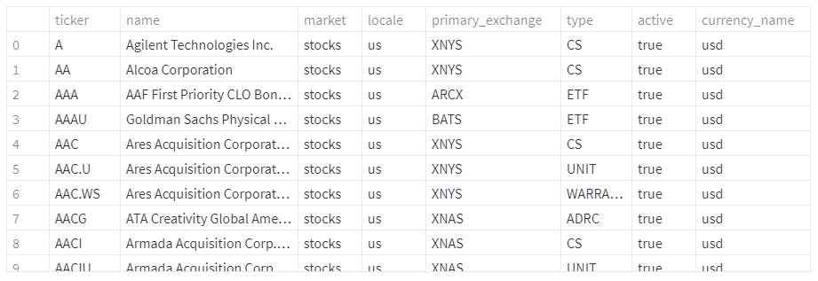
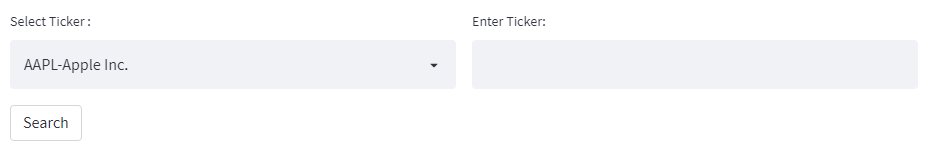
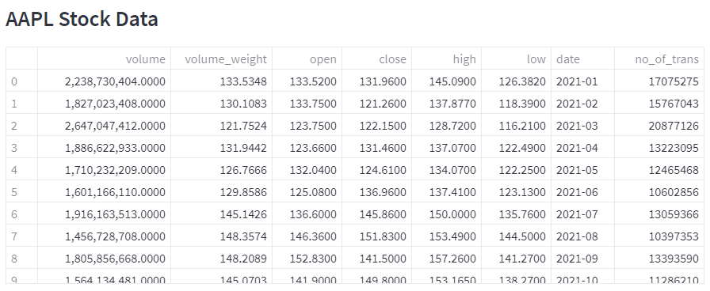
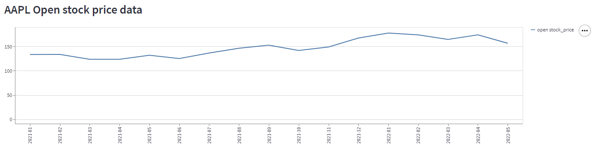
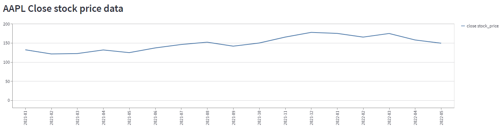
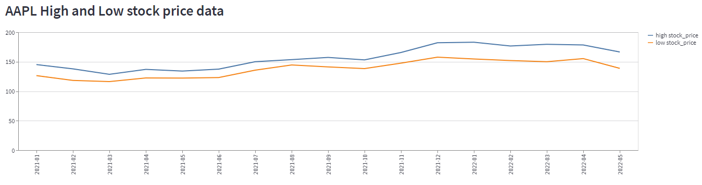
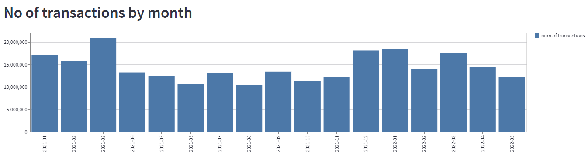
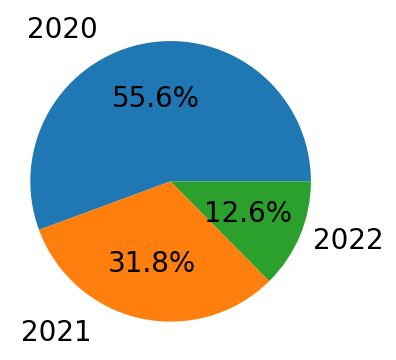

# Final Project
Financial Data Analysis

## Data
### Ticker List

### Tools (Select box, Text box, Search button)

### Stock Data

## Transformation
For Collect the data, we used a Polygon API and we got data in json format and then we convert those data into pandas dataframe.
After get the data in dataframe, we worked on clean the data like change the format of date.
Then we display our data in our streamlit application.

First we bind the list of Tickers and after that we add one dropdown list for names of stock and also one textbox if anyone doen't find their stock name in the dropdown list and then we add a submit button for review that selected stock data.

After press the search button, you can see the data of your stock and some visualizations for analysis.

## Visualizations

### Line chart for stock open price per month and year

### Line chart for stock close price per month and year

### Multiple Line chart for stock high and low price per month and year

### Bar chart for Number of Transaction per month and year

### Pie chart for volume percentage per year

## App
In our Application, we have done an analysis for Financial Data and for that we add some visualizations so people can see the trends and it helps them for buy or sell the stocks.
